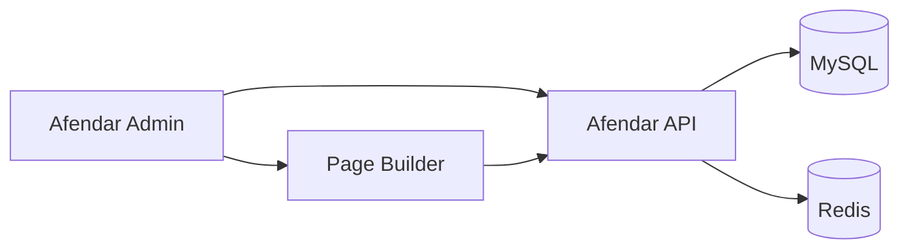

hide:
    - toc
    - navigation

# Administration

## 🖥️ Afendar Admin

Interface d'administration permettant de gérer et configurer les différentes fonctionnalités de la plateforme Afendar.

L'Admin s'appuie notamment sur l'API Afendar pour la gestion des données et propose un **Page Builder** permettant de construire dynamiquement les pages du site.

---

## Documentation

### 🧱 Architecture du Page Builder

Découvrez l'architecture du Page Builder, son fonctionnement interne et les différents éléments qui permettent de construire une page dynamiquement.

**Contenu :**

- architecture générale
- structure des pages
- composants du Page Builder
- cycle de rendu
- interactions avec l'API

[Explorer l'architecture →](page-builder/index.md){ .md-button .md-button--primary }

### 🧩 Composants du Page Builder

Documentation détaillée des différents composants disponibles dans le Page Builder.

Documentation à venir

### ⚙️ Configuration

Configuration spécifique de l'application d'administration.

Documentation à venir

---

## Architecture générale

L'application Admin communique principalement avec l'API Afendar pour récupérer et modifier les données.

!!!info

    Le Page Builder utilise les blocs et leur configuration fournis par l'API pour construire les pages administrables.
