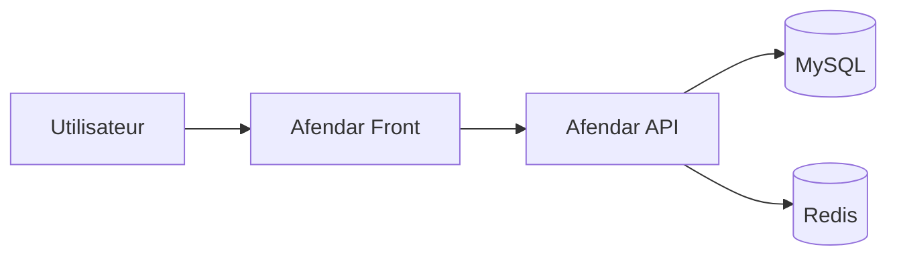

hide:
    - toc
    - navigation

# Front

## 🌐 Afendar Front

Application frontend principale de la plateforme Afendar.

Le Front consomme principalement les données exposées par l'API et utilise notamment les contenus configurés depuis l'interface d'administration.

---

## Documentation

### 🚧 Mode maintenance

Documentation du système de maintenance du Front.

Cette section présente :

- l'activation du mode maintenance
- son fonctionnement
- les conditions d'affichage
- la configuration associée

[Voir la documentation →](maintenance/index.md){ .md-button .md-button--primary }

### 🔌 Intégration avec l'API

Fonctionnement de la communication entre le Front et l'API Afendar.

Documentation à venir

### 🧱 Rendu des pages

Documentation du rendu des pages et des blocs provenant du Page Builder.

Documentation à venir

---

## Architecture

Le Front consomme les données exposées par l'API :

À terme, cette section documentera également le fonctionnement du rendu des pages générées par le Page Builder.